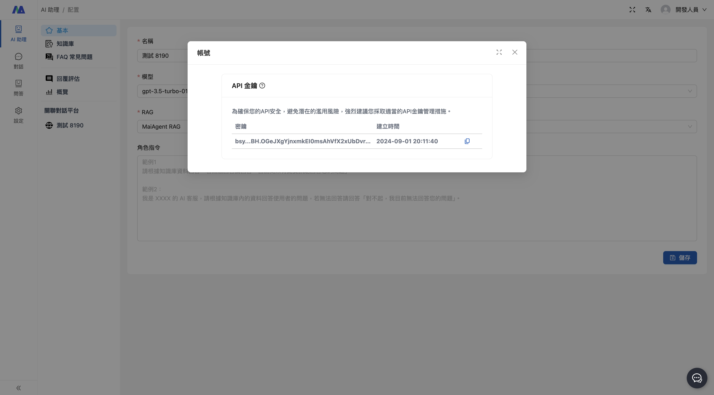

# 串接 MaiAgent API

API 文件請參考 [MaiAgent API 文件](https://documenter.getpostman.com/view/36982281/2sAXjQ3AgP#2030354f-8af9-4cf0-ad35-79d42836ae88)

## 拿取 API Key

請登入 [MaiAgent 系統後台](https://admin.maiagent.ai/)，根據以下步驟取得 API Key：

1. 於右上角點擊「使用者名稱」
2. 點擊「帳號」
3. 即可查看「API 金鑰」

## 設定 Webhook 網址

目前請將需要回傳的 `AI 助理` 與 `Webhook 的網址`提供給 MaiAgent窗口，我們將為你設定。

> 未來會開放給客戶自行設定。

## 取得 Web Chat ID

請使用 GET Inboxes API 取得 Web Chat ID。

> 未來會顯示於 `AI 助理` 頁面中。

## Python 範例

Python 範例請參考 [Python 範例](python/send_messages/README.md)
